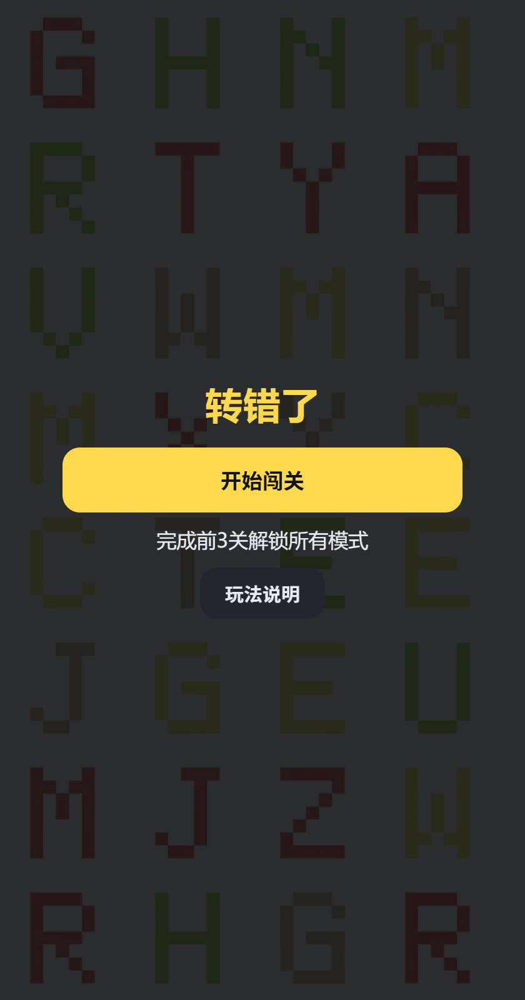
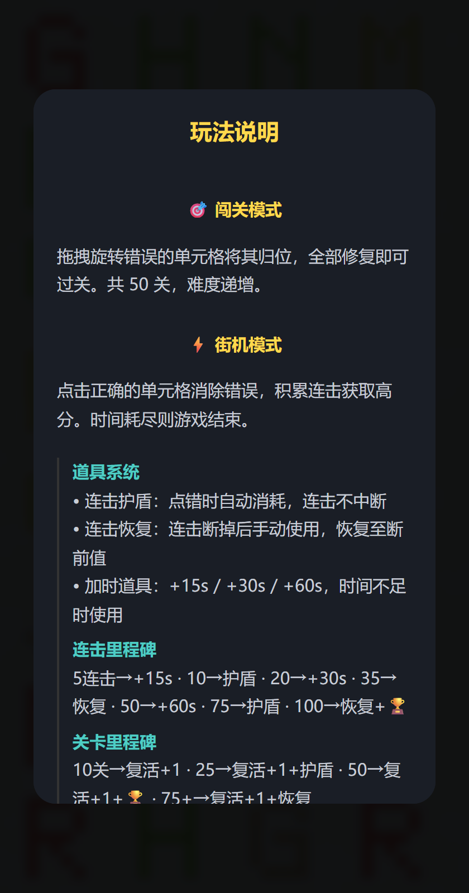
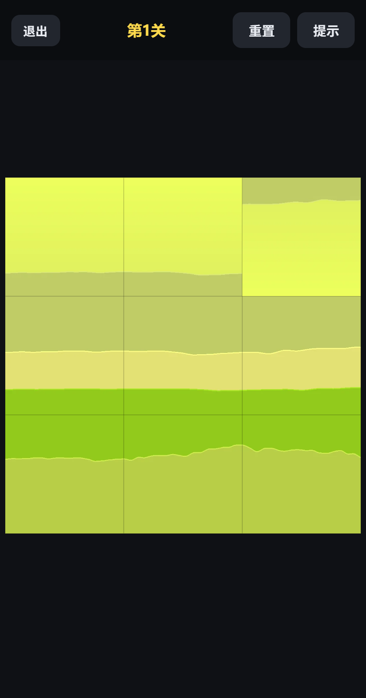
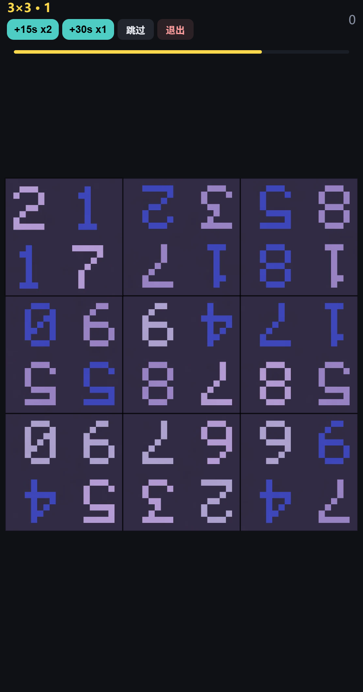

# 《转错了》设计思路文档

> 一张完整的图里，有一格被"转错了"。你的任务是找到它，把它转回来。
> 本文档阐述创意起源、核心玩法与爽点、各模式目的、难度梯度依据、技术架构铁律。

---

## 一、创意起源与根本灵感

### 1.1 根本灵感：把"不完美"变成"完美"的爽感

本作的原始冲动非常朴素：**强迫症患者看到错位的东西，会忍不住把它摆正，而摆正的那一下极其舒服**。
"转错了"把这种冲动做成了玩法——画面里有一格是"不完美"的，你把它转正，画面恢复完整，"完美"达成。破损→完整是一个普世的满足原型，不需要任何文化背景或教学就能触发。

### 1.2 与传统"找不同"的差异

传统找不同是**两图比对**，考验局部细节记忆；本作是**单图自洽性检验**，考验整体画面感知力：

- 人眼对线条、纹理、结构的**连续性断裂**极其敏感——山脊线、笔画、地平线一旦某格被旋转，违和感会"跳出来"；
- 人脑天然擅长判断"正"与"倒"——90°/180° 的字符立刻刺眼，5°~15° 的微旋则需主动扫描。

因此玩法**零教学成本**：任何人看到第一张图就懂自己要做什么。"一眼就懂，越玩越深"是玩法选型的第一原则。

### 1.3 演化路径：从单一模式到四模式矩阵

- **最开始只有闯关模式**，很快发现可玩性有限——固定关卡通关即止，缺乏重复游玩动机；
- 于是增加**街机模式**：限时 + 连击奖励，让玩家产生"玩下去"的心流和"互相比较"（分数/最高连击）的竞争兴趣，成为主打模式；
- 随后补全挑战（精度上限）与休闲（情绪缓冲），形成覆盖"快/准/深/松"四种情绪的模式矩阵（见第三章）。

### 1.4 可玩性来自随机性

固定内容会被背板，本作的不重样体验来自三层随机：

1. **随机的图**：62 族 × 3 = 186 张程序化生成图像，加上玩家自己的摄影作品；
2. **随机的旋转**：模板有限但旋转角度随机（90°~180°~微角度），同一张图每次出题观感不同；
3. **随机的分割**：square / hex / tri / voronoi 四种网格 + 随机 seed，同一张图的"切法"永远在变。

三者组合保证了天文数字级的题目空间，这是"再来一局"成本的物理基础。

### 1.5 不可协商的设计原则（六条铁律）

| # | 原则 | 落地情况 |
|---|------|----------|
| 1 | **3 秒上手**：第 1 关无文字教学，新手 5 秒内完成首次操作 | 引导关直接进玩法，规则靠画面自明 |
| 2 | **30 秒体会乐趣**：前 3 关合计 30 秒内通关，"归位吸附"必须有明确手感反馈 | 吸附 + 烟花 + 音效；第 3 关后发新手福利 |
| 3 | **3 分钟想再来**：单关 8~40 秒，超 60 秒视为设计失败 | 街机单题秒级，闯关单关十几秒 |
| 4 | **难度全部收敛在"找"，"转"是纯爽感环节**：归位零难度 | 拖拽松手按 15° 吸附；街机一键确认 |
| 5 | **绝不允许任何一关退化成"乱点碰运气"**：宁可降难度上限，也不放过一个不可解关卡 | 显著性门控 + 180° 对称守卫（见 4.2） |
| 6 | **不需要复杂美术和故事**：视觉只做到"干净、反馈清楚" | 程序化图像 + 极简 UI |

---

## 二、核心玩法

### 2.1 玩法定义

一张图被切分为 N×N（或非规则）网格，其中 1 格（后期 2~3 格）被旋转。玩家**观察 → 定位 → 操作 → 归位**。
每轮循环 2~8 秒，是极短的"假设—验证"闭环；短闭环带来高频小满足，是休闲游戏留存的基础节奏。

### 2.2 两种操作范式

| 范式 | 使用模式 | 考验能力 | 节奏 |
|------|----------|----------|------|
| **点击确认** | 街机 | 观察速度 + 决断力 | 快，一秒一题 |
| **拖拽旋转** | 闯关 / 休闲 / 挑战 | 空间推理 + 手眼协调 | 慢，有掌控感 |

同一"找错"内核拆成两种体验：点击是**识别题**（爽在快），拖拽是**还原题**（爽在掌控），一份内容撑起两种节奏。

### 2.3 爽点清单

1. **发现的顿悟**：扫描中"看到"错误格的瞬间；
2. **归位的圆满**：吸附回正 + 烟花 + 音效，呼应 1.1 的根本灵感；
3. **连击的数字增长**：x5、x10、x30……连击里程碑再把数字变成奖励节点；
4. **时间压力的心跳**：答对 +2.5s / 答错 -1.5s，"答对续命"的跑酷式经济；
5. **成长与收集**：星星、徽章、道具、网格形状解锁；
6. **内容的情感价值**：休闲模式用玩家自己的照片——"在自己的照片里找不同"。

---

## 三、各模式的设置目的

四个模式覆盖玩家情绪的四个象限：**快 / 准 / 深 / 松**。

### 3.1 街机模式（主打 · 爽点核心）

无限关卡、点击确认、倒计时、连击计分。承载高频短局体验与分数竞争；道具系统（护盾/恢复/加时）给反应玩法加入策略层；里程碑（10/25/50/75+ 关）把长跑切成有终点的短跑。

### 3.2 闯关模式（成长主线 · 教学载体）

50 关固定关卡、拖拽旋转、星级评价、无倒计时惩罚。前 3 关是新手引导；通关数解锁街机的新网格形状（20 关六边形 / 26 关三角 / 39 关 Voronoi / 50 关混沌），让闯关产出反哺街机。

### 3.3 挑战模式（精度维度 · 高手向）

10 关计时、每关 **2 个**错误格、旋转角仅 **5°~14°**。街机考"快"，挑战考"准"，为高手提供另一种精通路径。双目标要求"找全"，鼓励系统性全盘检查。

### 3.4 休闲模式（情绪缓冲 · 内容差异化）

15 关玩家自己的摄影作品，不计时、无惩罚、可跳过。心流理论中的恢复区，也是最强的情感钩子。

### 3.5 模式协同

```
新手引导(闯关1-3) ──→ 街机(主打爽点) ←──→ 挑战(精度上限)
        │                    ↑
        └──→ 闯关(长期成长)──┘(解锁形状反哺)
        休闲(情绪恢复 + 个性化内容)
```

---

## 四、难度梯度与设置原因

### 4.1 三维难度体系

难度不靠数值压榨，而靠**题目本身的可识别性**，三个维度自由组合：

1. **图像特征显著度分级**
   - 低难度：方向特征强烈（人物、建筑、明确线条、强方向性纹理），旋转后违和感强；
   - 高难度：方向特征模糊（均匀纹理、无序花丛、星空、噪点），旋转后差异极弱。
2. **网格划分密度**
   - 低难度：3×3/4×4，单格信息完整，朝向判断简单；
   - 高难度：5×5/6×6 及以上，单格高度碎片化，有效方向信息少。
3. **网格形态进阶**
   - 基础：正方形网格，90°/180°/270° 三档旋转，最符合直觉；
   - 进阶：六边形、三角形，旋转角变为 60° 倍数，拼接边更多、方向参考更少；
   - 高阶：Voronoi 随机多边形，无统一形状与角度规律，彻底消除网格规律带来的提示。

外加第四个变量**旋转角度**（180° → 90°/270° → 微角度），四旋钮正交、可独立调节、可量化，因此能精确画出难度曲线。

### 4.2 形式化难度模型（S / C / D）

原始设计给出了可计算的难度模型，本作的所有"难度"都不是拍脑袋：

- **S 违和度**（越大越好找）= 边界梯度断裂度 + λ·(1 − SSIM(旋转前后格内容))
- **C 干扰度**（越大越难）= 若被旋转、违和度 > τ·S(target) 的其他格子占比
- **D 总难度** = α/Ŝ + β·Ĉ + γ·log(N_grid) + δ·F_shape + ε·A_θ
  - 初始权重 α,β,γ,δ,ε = 0.30, 0.30, 0.15, 0.15, 0.10
  - F_shape：square=0, hex=0.3, tri=0.5, voronoi=0.8
  - A_θ：180°=0, 90°/270°=0.4, ±30° 微旋=1.0
- **硬门槛**：S > S_min 的关卡才允许入选，**包括第 50 关**。

实现对照：`core/salience.ts` 计算 S；街机出题优先选高 S 目标；**MinVar 方差门控**（格内方差过低的纯色块不得作为目标）与 **180° 对称守卫**（中心对称格旋转 180° 后 S≈0，自动剔除）是硬门槛在运行时的双重保险——共同兑现铁律 5："绝不允许乱点碰运气"。

### 4.3 关卡曲线：锯齿上升 + 10 关节奏包

**不要单调递增，玩家会累。** 采用"教学 → 展开 → 变奏 → 压力 → 高潮 → 回落奖励"的循环，难度锯齿式上升，每个压力峰后必有回落奖励关。

曲线铁律：

1. **新机制首次出现的那一关，总难度降一档**——让玩家在低压力下认识新规则；
2. **连续两关不得都 D ≥ 8**；每个关口关之后必有回落关；
3. **相邻 5 关不得重复同一张图**；每 10 关至少切换一次网格形态；
4. **变奏节点固定**：

| 关卡 | 首现机制 | 实现对照 |
|------|----------|----------|
| 20 | 六边形 | 闯关 20 关解锁 hex |
| 26 | 三角形 | 闯关 26 关解锁 tri |
| 32 | 双目标 | 演化：移入挑战模式（每关 2 目标），主线心流不被打断 |
| 39 | Voronoi | 闯关 39 关解锁 voronoi |
| 45 | 微角度 | 演化：移入挑战模式（5°~14°），作为精度标尺 |

5. **前 10 关不出现任何 UI 文字**——靠画面与反馈完成教学（实现中 HUD 仅保留极简计数，无规则性文字）。

> 设计演化说明：原案把双目标与微角度放在主线 32/45 关。实际迭代中将二者移入挑战模式，因为主线承载大众心流，极难机制会制造挫败；拆出去后主线保持平滑锯齿，高手另有去处——这是"难度分层服务不同玩家"的具体实践。

### 4.4 街机的动态难度曲线

```
effectiveCombo = max(当前连击, 已通过关数 × 0.5)
```

- 难度只跟连击走会在失误后断崖下跌，加入总关数保底使曲线平滑；
- **时间固定 8 秒不随难度缩短**：紧张感来自题目识别，不来自钟表焦虑；
- 答对 +2.5s / 答错 -1.5s，奖励大于惩罚，整体倾向鼓励。

### 4.5 玩家主权

主页提供基础时间（5/8/12/20s）与最小方差（0~50%）两档自定义。最好的难度系统是玩家自己调出来的。

---

## 五、反馈与奖励的分层（爽点的支撑结构）

| 层级 | 内容 | 心理作用 |
|------|------|----------|
| 即时（<1s） | 吸附动画、烟花粒子、音效、闪屏 | 操作手感 |
| 短期（单局） | 连击、得分、时间奖励 | 心流维持 |
| 中期（跨局） | 道具、复活、连击/关卡里程碑 | 目标感、策略储备 |
| 长期（账号） | 星星、徽章、形状解锁、最高分 | 身份与收藏 |

里程碑节点让玩家永远知道"下一个奖励还差几关"，退出成本被不断推后；弹窗期间计时暂停，保证奖励时刻是纯粹的庆祝。新手福利（全道具各一 + 复活 +1）既是奖励，也是道具功能的实物教学。

---

## 六、技术架构与工程铁律

### 6.1 技术栈（固定）

TypeScript + Vite；渲染用原生 Canvas 2D，不引入游戏引擎；唯一运行时依赖 d3-delaunay（仅 Voronoi 网格）；无后端，存档 localStorage，音效 Web Audio API；纯 H5、移动端竖屏单手可玩、静态部署。

### 6.2 目录结构

```
/core    纯逻辑，零 DOM 依赖，Node 与浏览器共用（grid / salience / rng / difficulty / types）
/gen     Node CLI：图像生成 → 打分 → 过滤 → 关卡编排（gen-images / gen-levels / gen-relax）
/game    Canvas 渲染 / 输入 / tween / 特效 / 各模式会话
/assets  程序化图像 WebP（短边 1080px）+ 玩家照片
/levels  levels.json（纯数据）
/tests   单元测试
```

### 6.3 架构铁律

- **`core/grid.ts` 被生成器与渲染器共用**：同一 seed + 同一参数，在 Node 与浏览器必须产出完全相同的顶点数组与 cellId 顺序，配一致性单测；
- **`/core` 禁止出现 document/window/canvas/Image** 等浏览器 API；
- **关卡数据是纯 JSON**，不含任何逻辑或代码；
- **随机数必须用可复现的 seeded PRNG（mulberry32）**，禁止裸用 Math.random() 于关卡生成路径。

### 6.4 关卡数据格式

```json
{
  "id": 39, "difficulty": 4.6, "image": "img/mosaic_07.webp",
  "grid": { "type": "voronoi", "seed": 20481, "cells": 24 },
  "targets": [ { "cellId": 13, "rotation": 137.5 } ],
  "limits": { "timeLimit": null, "hints": 1 },
  "star": { "clicks": [1, 3, 6], "time": [8, 20, 40] },
  "meta": { "S": 0.42, "C": 0.19, "V_image": 0.71 }
}
```

### 6.5 性能约束与实现

- 原案铁律：非目标格绘制到离屏缓存，**帧成本与格子总数无关**；实现中以逐格裁剪重绘 + 亮度矩阵降采样（540px 工作分辨率）控制计算量，中端移动设备保持流畅；
- 体积：在线版首屏只加载主 bundle 与当前关卡资源，图像渐进入缓存；离线包 `game.html` 内嵌全部资源（base64），以体积换零网络依赖；
- 加载：休闲/挑战模式 `Promise.all` 并行预加载，进入时间从 5~10s 降至 1~2s。

---

## 七、界面实录

| 新手引导主页 | 玩法说明 |
|---|---|
|  |  |

| 闯关对局 | 街机对局 |
|---|---|
|  |  |

- 闯关截图：3×3 风景图，右上格旋转 180°，地平线断裂清晰——strong 档题目的典型可读性；
- 街机截图：左上 HUD 为网格·关卡号、道具条、倒计时条；字母图中目标格字符方向异常，点击即得分。

---

## 八、设计原则小结

1. **根本灵感**：把"不完美变完美"的冲动做成玩法，归位那一下必须舒服；
2. **一眼就懂，越玩越深**：零教学成本，难度靠可量化的视觉特征调节；
3. **难度来自努力，不来自坏题**：S/C/D 模型 + 硬门槛，生成期消灭死题；
4. **锯齿曲线**：教学→展开→变奏→压力→高潮→回落，不单调递增；
5. **短闭环、高频满足**：2~8 秒一轮假设—验证，反馈即时且分层；
6. **四模式四情绪**：快/准/深/松互相供血；随机性保证不重样；
7. **玩家主权**：时间、清晰度、模式皆可自选；
8. **内容即情感**：程序化图像保证供给与难度可控，玩家照片保证独一无二。

---

## 附录：交付成果与迭代文档

- **最终游戏作品**：H5 在线版（GitHub Pages）+ 单文件离线包 `game.html`；
- **设计思路文档**：即本文（DESIGN.md）；
- **迭代优化过程文档**：见 `CHANGELOG.md`，记录每次版本修改的内容、Bug 根源与设计思考（含与 AI 协作的完整迭代轨迹）。
