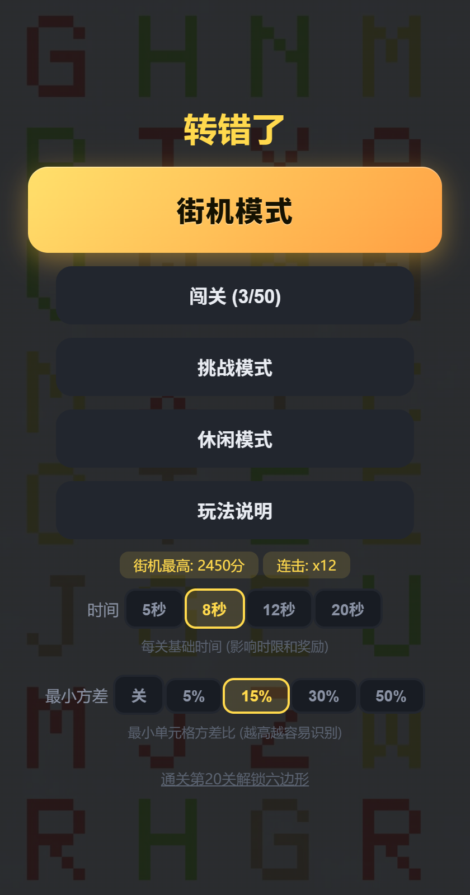

# 《转错了》设计思路文档

> 一张完整的图里，有一格被"转错了"。你的任务是找到它，把它转回来。
> 本文档阐述核心玩法与爽点设计、各模式的设置目的、难度梯度的设计依据。

---

## 一、核心玩法

### 1.1 玩法定义

玩家面对一张被切分为 N×N 网格的图片，其中若干单元格被旋转了某个角度。
玩家需要**观察 → 定位 → 操作 → 归位**，让图片恢复完整。

这个玩法建立在人类视觉的两个天然特性上：

1. **连续性敏感**：人眼对线条、纹理、结构的"断裂"极其敏感。一张风景图的山脊线、一张字母图的笔画，一旦某格被旋转，连续性就被破坏，玩家会本能地"觉得哪里不对"。
2. **方向感**：人脑擅长判断"正"与"倒"。旋转 90°/180° 的字符、地平线、箭头会立刻显得刺眼；而 5°~15° 的微旋转则需要主动扫描才能发现——这正好构成了天然的难度光谱。

因此本游戏不需要任何教学成本：任何人看到第一张图就懂自己要做什么。**"一眼就懂，越玩越深"** 是玩法选型的第一原则。

### 1.2 核心循环

```
观察全图（扫描断裂点）
      ↓
定位可疑格（假设）
      ↓
操作（点击确认 / 拖拽旋转）
      ↓
即时反馈（吸附归位 + 烟花 + 音效 + 连击/时间奖励）
      ↓
下一题（难度随表现动态变化）
```

每一轮循环只有 2~8 秒，是一个极短的"假设—验证"闭环。短闭环带来高频率的小满足，这是休闲游戏留存的基础节奏。

### 1.3 两种操作范式

| 范式 | 使用模式 | 考验能力 | 节奏 |
|------|----------|----------|------|
| **点击确认** | 街机 | 观察速度 + 决断力 | 快，一秒一题 |
| **拖拽旋转** | 闯关 / 休闲 / 挑战 | 空间推理 + 手眼协调 | 慢，有掌控感 |

设计原因：同一个"找错"内核，用两种操作拆成两种体验。
- 点击是**识别题**——"我看到你了"，爽在快；
- 拖拽是**还原题**——"我把它修好了"，爽在掌控。
两者共享同一套图像与难度系统，但情绪完全不同，一份内容撑起了两种节奏。

### 1.4 爽点清单

1. **发现的顿悟**：扫描中突然"看到"错误格的瞬间，是解谜游戏最原始的多巴胺。
2. **归位的圆满**：格子吸附回正、图片恢复完整的一刻，配合烟花粒子与音效，形成强烈的"修复感"。破损→完整是一个普世的满足原型。
3. **连击的数字增长**：街机模式连击 x5、x10、x30……数字本身就是正反馈；连击里程碑（5/10/20/…/100）再把数字变成奖励节点。
4. **时间压力的心跳**：倒计时条制造紧张；答对 +2.5s、答错 -1.5s 形成清晰的风险—奖励经济，"答对续命"的手感类似跑酷游戏的拾取续命，压力与释放交替。
5. **成长与收集**：星星、徽章、道具、网格形状解锁（六边形/三角/ Voronoi），给短循环套上长期目标。
6. **内容的情感价值**：休闲模式使用玩家自己的摄影作品——"在自己的照片里找不同"，把工具性玩法变成情感体验。

---

## 二、各模式的设置目的

四个模式不是功能堆叠，而是覆盖玩家情绪的四个象限：**快 / 准 / 深 / 松**。

### 2.1 街机模式（主打 · 爽点核心）

- **形态**：无限关卡、点击确认、倒计时、连击计分。
- **目的**：承载核心爽点的高频短局体验。一局 1~3 分钟，随时开始随时结束，适合碎片时间；分数与最高连击提供自我竞争目标。
- **设计重点**：
  - 难度随连击与总关卡数动态上升（见第三章），形成"越玩越难、难而有趣"的心流通道；
  - 道具系统（连击护盾 / 连击恢复 / 加时）给纯反应玩法加入**策略层**：护盾留给高连击时刻、加时留给残血时刻，决策本身也是乐趣；
  - 里程碑奖励（10/25/50/75+ 关）把长跑切成一段段有终点的短跑。



### 2.2 闯关模式（成长主线 · 教学载体）

- **形态**：50 关固定关卡，拖拽旋转，星级评价，无倒计时惩罚。
- **目的**：
  1. **教学**：前 3 关是新手引导，用拖拽这种慢操作教会玩家"旋转归位"的完整心智模型；
  2. **成长骨架**：50 关线性推进 + 星星评价，提供明确的长期进度条；
  3. **解锁阀门**：通关数解锁街机的新网格形状（20 关六边形 / 26 关三角 / 39 关 Voronoi / 50 关混沌），让闯关的产出反哺街机，两个模式互相供血。
- **为什么用拖拽而不用点击**：慢操作降低新手挫败，"亲手转回来"的动作强化了核心心智模型，也为后续休闲模式定调。


### 2.3 挑战模式（精度维度 · 高手向）

- **形态**：10 关计时，每关 **2 个**错误单元格，旋转角仅 **5°~14°**。
- **目的**：街机考"快"，挑战考"准"。微旋转几乎不破坏整体观感，玩家必须逐格扫描纹理走向，把玩法从"直觉识别"推向"主动检验"，为高手提供区别于街机的另一种 mastery（精通）路径。
- **为什么是 2 个错误格**：单目标在微角度下容易变成纯运气扫描；双目标要求"找全"，鼓励系统性的全盘检查，完成后满足感翻倍。

### 2.4 休闲模式（情绪缓冲 · 内容差异化）

- **形态**：15 关玩家自己的摄影作品，拖拽旋转，**不计时、无惩罚、可跳过**。
- **目的**：
  1. **情绪出口**：高压模式之间需要一个"只是玩玩"的地方，休闲模式承担心流理论中的恢复区；
  2. **个性化**：用自己的照片玩游戏是市面上几乎没有的体验，它把游戏变成个人相册的互动版本，是最强的情感钩子与分享动机；
  3. **难度验证场**：4×4 网格 + 90/180/270 角度，比闯关略难、比街机松弛，恰好是"有点挑战但不会输"的舒适区。

### 2.5 模式协同关系

```
新手引导(闯关1-3) ──→ 街机(主打爽点) ←──→ 挑战(精度上限)
        │                    ↑
        └──→ 闯关(长期成长)──┘(解锁形状反哺)
                             ↑
        休闲(情绪恢复 + 个性化内容)─┘
```

玩家在任何一种情绪下都有去处：想爽去街机，想静去休闲，想证明自己去挑战，想积累去闯关。

---

## 三、难度梯度与设置原因

### 3.1 难度的三个旋钮

本游戏的难度不靠"血条变薄"式的数值压榨，而是靠**题目本身的可识别性**，共三个旋钮：

| 旋钮 | 范围 | 影响 |
|------|------|------|
| 网格规模 | 3×3 → 4×4 → 5×5 → 6×6（及非方形网格） | 搜索空间变大、单格变小、格内特征变少 |
| 旋转角度 | 90/180/270 → 任意角 → 5°~14° 微角 | 角度越小，方向线索越弱 |
| 图像显著性 | strong / mid / weak 三档 + 最小方差门控 | 纹理越弱，断裂越难察觉 |

**为什么选这三个**：它们分别对应人类视觉的三种负担——搜索负担（在哪）、方向负担（转了多少）、特征负担（看得出吗）。三者正交、可独立调节、可量化，因此能精确地画出难度曲线，而不是靠手感拍脑袋。

### 3.2 显著性（Salience）量化：难度可控的技术基础

所有图像为**程序化生成**（62 族 × 3 = 186 张），生成时即对每个候选格计算旋转显著性 S（旋转前后区域差异度）：

- 出题时优先选 S 高的格子，保证"一定有解且可被看出"；
- **最小方差门控（MinVar）**：格内方差过低的纯色块不允许作为目标——纯色块旋转后毫无特征，是"死题"。主页提供 0%~50% 的门控档位，把"题目质量"也交给玩家自定义；
- **180° 对称守卫**：中心对称的格子旋转 180° 后视觉不变（S≈0），此类目标会被自动剔除，避免"无解之题"。

> 设计哲学：**难度应该来自"需要努力才能看出"，而不是来自"题目本身坏了"**。所有不可识别的死题在生成期就被消灭。

### 3.3 街机的动态难度曲线

```
effectiveCombo = max(当前连击, 已通过关数 × 0.5)
```

- **为什么取两者较大值**：若难度只跟连击走，一次失误会让难度断崖下跌，玩家感到"变无聊了"；加入总关数保底后，难度只升不降得太快，曲线平滑；
- **为什么时间固定 8 秒不随难度缩短**：缩短时间制造的是焦虑而不是挑战。本游戏选择让"识别难度"承担难度增长，时间保持恒定，玩家始终有完整的观察窗口——紧张感来自题目，不来自钟表；
- **答对 +2.5s / 答错 -1.5s**：奖励大于惩罚的 1.67 倍，整体倾向鼓励，符合休闲定位；上限 20s 防止囤积。

### 3.4 闯关 50 关的梯度安排

- **1~10 关**：3×3/4×4，90/180/270 大角度，strong 图像。目标：建立"我能行"的自信，教会操作；
- **11~25 关**：引入 4×4/5×5 与任意角度，mid 图像。目标：从"直觉识别"过渡到"主动扫描"；
- **26~39 关**：三角/ Voronoi 等非方形网格登场。非方形格破坏"横平竖直"的扫描习惯，迫使玩家按形状边界阅读图像；
- **40~50 关**：weak 图像 + 小角度 + 多目标。综合考验，通关即"毕业"，解锁街机混沌形态。

节奏上每 10 关一个台阶，与里程碑奖励节点对齐：**难度上升的同时奖励也上升**，压力与回报同步增长。

### 3.5 挑战模式的极难设计

微角度（5°~14°）+ weak 图像 + 双目标，是三个旋钮同时拧到高位的组合。它存在的意义不是为难大众，而是给核心玩家一个**可炫耀的精度标尺**——完成挑战 10 关是一种身份标识。

### 3.6 玩家主权：可选难度

主页提供两档自定义：
- **基础时间（5/8/12/20s）**：反应型玩家选 5s 追求刺激，观察型玩家选 20s 享受扫描；
- **最小方差（0~50%）**：控制题目特征强度，等价于"清晰度"档位。

> 设计哲学：**最好的难度系统是玩家自己调出来的**。提供档位既尊重个体差异，也让"我今天状态好，调高一点"成为日常小目标。

---

## 四、反馈与奖励的分层（爽点的支撑结构）

| 层级 | 内容 | 心理作用 |
|------|------|----------|
| 即时（<1s） | 吸附动画、烟花粒子、音效、闪屏 | 每个动作都有回响，操作手感 |
| 短期（单局） | 连击、得分、时间奖励 | 心流维持 |
| 中期（跨局） | 道具、复活次数、连击/关卡里程碑 | 目标感、策略储备 |
| 长期（账号） | 星星、徽章、形状解锁、最高分 | 身份与收藏 |

里程碑节点（10/25/50/75+ 关、5~100 连击）的设计遵循**可变节点奖励**：玩家永远知道"下一个奖励还差几关"，退出成本被不断推后，这是短局游戏对抗流失的核心手段。弹窗期间计时暂停，保证奖励时刻是纯粹的庆祝而非负担。

新手引导 3 关完成后发放"全道具各一 + 复活 +1"的新手福利，既是对完成引导的奖励，也是一次**道具功能的实物教学**——玩家拿着护盾进街机，自然会在实战中学会它的用法。

---

## 五、界面实录

| 新手引导主页 | 玩法说明 |
|---|---|
|  |  |

| 闯关对局 | 街机对局 |
|---|---|
|  |  |

- 闯关截图：3×3 风景图，右上格旋转 180°，天空与草地的交界线断裂——这是 strong 档题目的典型可读性；
- 街机截图：左上 HUD 依次是网格·关卡号、道具条（+15s/+30s/跳过/退出）、倒计时条；字母图中多个格子的字符方向异常，点击唯一"被旋转的目标格"即得分。

---

## 六、设计原则小结

1. **一眼就懂，越玩越深**：玩法零教学成本，难度靠可量化的视觉特征调节；
2. **难度来自努力，不来自坏题**：生成期消灭死题，显著性门控保证每题可解；
3. **短闭环、高频满足**：2~8 秒一轮假设—验证，反馈即时且分层；
4. **四模式四情绪**：快（街机）/ 准（挑战）/ 深（闯关）/ 松（休闲），互相供血；
5. **玩家主权**：时间、清晰度、模式皆可自选，难度是协商出来的；
6. **内容即情感**：程序化图像保证无限供给与难度可控，玩家照片保证独一无二。
