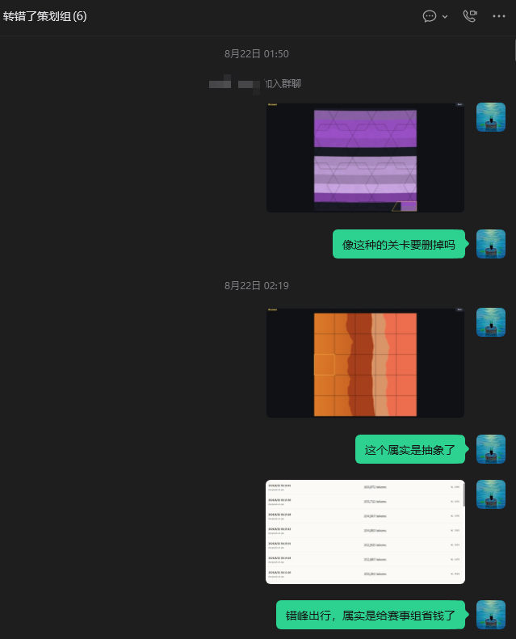
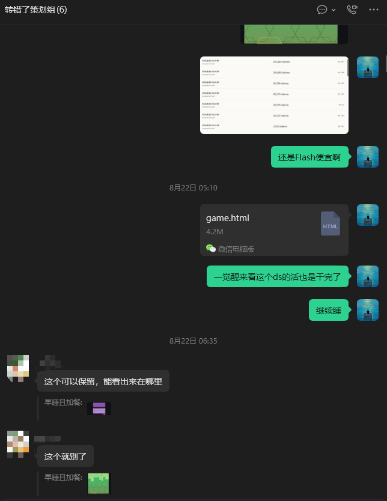
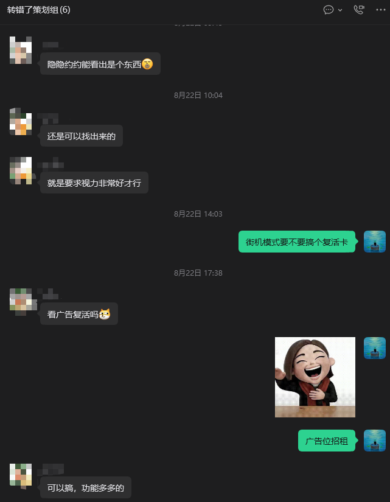
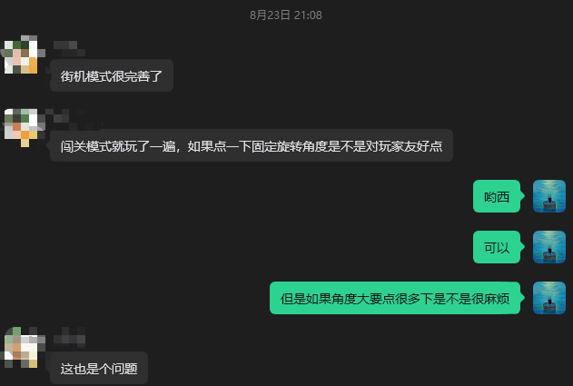
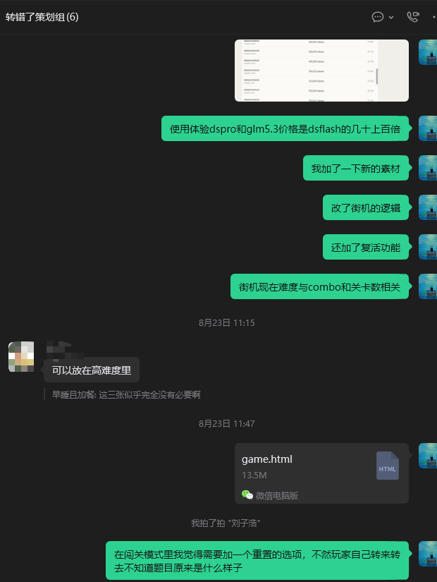
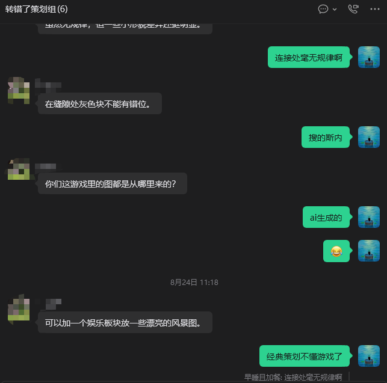
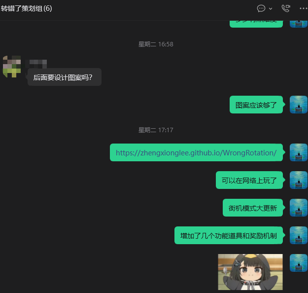
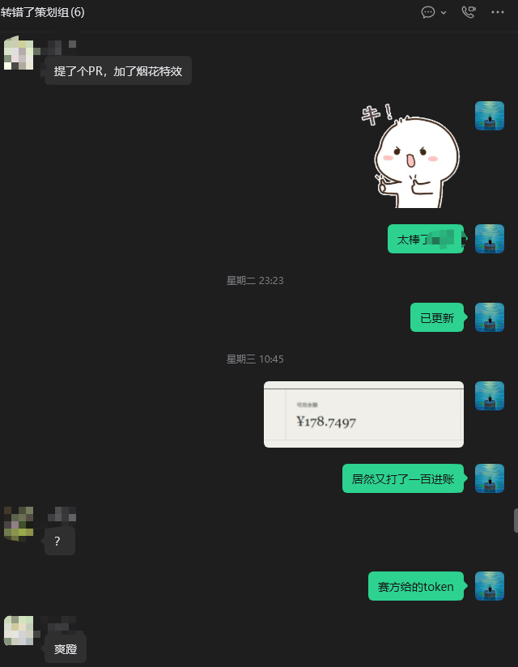
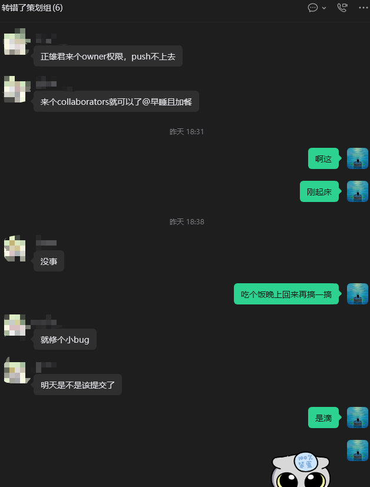

# 《转错了》迭代优化过程文档

> 本文档基于 `CHANGELOG.md` 与策划组聊天记录，复盘整个开发过程中**作者与 AI 的协作方式**与**不断改进的轨迹**。
> 协作模式概括为一句：**人负责"要什么"和"哪里不对"，AI 负责"怎么做"和"做到位"**——人给出方向性指令与试玩反馈（很多来自策划组群聊），AI 定位根因、实现、构建、部署，人再复测，形成高频闭环。

---

## 0. 协作方法论

| 环节 | 人的角色 | AI 的角色 |
|------|----------|-----------|
| 立项 | 提供原始创意与不可协商的设计规格（六条铁律、S/C/D 难度模型、曲线铁律） | 搭建工程骨架，把规格翻译成可执行代码 |
| 迭代 | 一句话反馈："太简单了""会遮挡""还是太纯色" | 自行读码定位、实现、typecheck、build、部署 |
| 外部反馈 | 把策划组群聊截图/意见转述给 AI | 将非结构化意见转化为具体改动项 |
| 质量 | 真机试玩验收 | 自动化验证（tsc / 构建 / 截图脚本） |
| 沉淀 | 要求"记录每次修改与思考" | 维护 CHANGELOG / DESIGN / 本文档 |

关键习惯：**每次版本更新都记录"改了什么 + 为什么改"**，使迭代可追溯；本文档即由 CHANGELOG 反向生成。

---

## 1. V1 立项：把创意规格变成可运行骨架（v1.0）

- **人的输入**：完整原始规格——一句话玩法、六条不可协商原则、目录结构、架构铁律（core 零 DOM、grid.ts 双端共用、seeded PRNG、纯 JSON 关卡）、难度模型与 50 关曲线铁律。
- **AI 的工作**：TypeScript + Vite + Canvas 2D 工程落地；`core/` 纯逻辑与 `gen/` 生成器共用网格代码；186 张程序化图像（62 族 × 3）+ 质量门控；闯关 50 关编排。
- **改进点**：第一版即内置"显著性 S 门控"，从源头兑现"绝不允许乱点碰运气"。

---

## 2. 策划组夜审：质量门控与坏图清除（v1.10 的起点）

8 月 22 日凌晨，作者把可疑关卡截图发进群："像这种的关卡要删掉吗""这个属实是抽象了"。**人工试玩暴露了生成器的盲区**：部分图案族（花丛、木纹、扇形等）在网格下几乎无方向特征。

- **AI 的响应**：删除 flowers/wood/diamond/fan 等图案族；修复 snowflake/feather/scale/fingerprint 等全画布覆盖问题；引入平坦度门控（flat > 60% 自动重试）。
- **协作意义**：这是"人眼验收 + 机器批量修复"的第一次完整循环——人只需要指出"这张不行"，AI 负责把同类问题一次性消灭。

同日凌晨，离线包 `game.html`（当时 4.2M）进群，策划组开始**逐图人工筛选**："这个可以保留，能看出来在哪里""这个就别了"。这份手工过滤清单直接成为图案族去留的依据，也推动了后续 PWA 与离线包的持续瘦身。

---

## 3. 复活与道具系统的诞生：群聊里的一句话需求（v1.3 / v1.8）

群聊中两条关键意见：

1. "就是要求视力非常好才行"——weak 档图像的难度争议，促使作者把**最小方差（MinVar）做成玩家可调档位**，把难度争议转化为玩家主权；
2. "街机模式要不要搞个复活卡"——复活功能的最初来源。作者与 AI 讨论后落地为：复活保留连击、不阻挡里程碑奖励、次数通过里程碑 earned；并进一步扩展出**道具系统**（连击护盾 / 连击恢复 / +15s / +30s / +60s）与连击里程碑奖励，把"复活卡"一句话长成了一套经济系统。

---

## 4. 操作范式之争：点一下 vs 拖拽（v1.2 / v1.7）

"闯关模式……如果点一下固定旋转角度是不是对玩家友好点" → "但是如果角度大要点很多下是不是很麻烦" → "这也是个问题"。

- **讨论结论**：点击适合街机的"识别"节奏，但闯关/休闲的"还原"体验需要连续操作——最终确立**拖拽旋转 + 15° 吸附**范式，"转"的环节零难度、纯爽感，兑现铁律 4。
- **AI 的角色**：把一次群聊争论转化为明确的交互决策，并在休闲模式从"点击自动修复"改为拖拽时复用了同一套输入管线（pointerdown 委托 + 角度增量计算）。

同一阶段（见 CHANGELOG v1.2），作者试玩后要求加**重置按钮**："不然玩家自己转来转去不知道题目原来是什么样子"（见下图 3），AI 即刻实现并沉淀为闯关/休闲的标配。

---

## 5. 进度同步会：难度公式与重置选项落地（v1.3）

作者在群里同步与 AI 协作的产出："加了新的素材""改了街机的逻辑""还加了复活功能""街机现在难度与 combo 和关卡数相关"——即 CHANGELOG v1.3 的 `effectiveCombo = max(combo, totalLevels×0.5)` 公式；群友回复"可以放在高难度里"，帮助确认了难度分层的取向。同期提出的闯关"重置"选项也在该版本落地。

- **协作意义**：群聊充当了**每日站会**，作者把 AI 的产出拿去接受同伴评审，再把评审意见带回给 AI 执行。

---

## 6. 休闲模式的起源："加一个娱乐版块"（v1.5 → v1.7）

这张截图包含两个重要输入：

1. **图像质量反馈**："连接处毫无规律啊""在缝隙处灰色块不能有错位"——推动生成器多轮重写（接缝对齐、色块渐变、最终 mosaic 族改为 noise 选色 + 格内渐变 + 子像素噪点，见 CHANGELOG v1.10）；
2. **模式创意**："可以加一个娱乐版块放一些漂亮的风景图"——**休闲模式由此立项**，从风景图筛选版（v1.5）演进到拖拽交互 + 玩家自有照片（v1.6/v1.7），最终成为本作最差异化的情感模块。

---

## 7. 上线与道具大更新：从本地玩具到网络产品（v1.1 / v1.12 / v1.13）

"后面要设计图案吗？"→"图案应该够了"——确认程序化图像供给达标；随后作者把 GitHub Pages 链接发进群："可以在网络上玩了""街机模式大更新""增加了几个功能道具和奖励机制"。

- **AI 的工作**：PWA（network-first SW）→ GitHub Pages 部署 → 主页"玩法说明"弹窗 → 按钮文案规范化（挑战模式/休闲模式）→ 道具/跳过按钮位置调整（不遮挡题目）。
- **改进节奏**：每一次"发链接进群"都是一次真实分发测试，群友的机型与网络差异暴露了缓存、遮挡、加载慢等问题，逐条进入 CHANGELOG。

---

## 8. 团队 PR 协作：烟花特效由队友提交（v-Unreleased）

"提了个 PR，加了烟花特效"——队友 cantorxu 在 GitHub 上提交 Pull Request #1。**协作从"人↔AI"扩展为"人↔人AI"**：AI 负责审阅 PR（检查模块独立性、与既有 paused 计时逻辑的兼容）、合并、重新部署，并保留双方改动互不破坏。

"正雄君来个 owner 权限，push 不上去""来个 collaborators 就可以了"——展示了真实的团队工程流程：权限申请 → 分支开发 → PR → 审阅合并。"明天是不是该提交了"则标记了交付节点，推动收尾阶段的一系列打磨（计时暂停修复、乱码修复、选关滚动条、文档三件套）。

---

## 9. 收尾阶段的"人机互纠"：三个典型 Bug 的修复方式

1. **计时器不流逝**（v-Unreleased）：AI 第一版把 `paused = true` 写在无条件代码块，导致每关都暂停——**人复测发现"第二关开始时间不流逝"，AI 定位根因并移入里程碑分支**。
2. **奖励文本乱码**：AI 误用 PowerShell `-replace` 破坏 UTF-8——**人截图反馈乱码，AI 从 git 恢复并用编辑工具重做**，并从此改用安全的编辑路径。
3. **弹窗偷时间**：人提出"弹窗时不要消耗关卡时间"，AI 用 paused 标志实现；又因连击弹窗遗漏被二次反馈补全。

这三个案例体现了协作闭环的成熟：**人不需要懂代码，只需要准确描述现象；AI 负责把现象翻译成根因与补丁**。

---

## 10. 迭代轨迹总览（CHANGELOG 摘要）

| 版本 | 主题 | 反馈来源 |
|------|------|----------|
| v1.0 | 框架 + 50 关 + 186 图 | 原始规格 |
| v1.1 | PWA 与离线包 | 交付需求 |
| v1.2 | 闯关拖拽/重置/提示 | 作者试玩 |
| v1.3 | 街机大改（难度公式/跳过/复活） | 策划组（图 3、5） |
| v1.4 | 挑战模式 | 难度分层设计 |
| v1.5~v1.7 | 休闲模式 + 玩家照片 + 拖拽化 | 策划组（图 2） |
| v1.8 | 道具系统与里程碑 | 策划组（图 5） |
| v1.9 | 引导流程与新手福利 | 作者体验 |
| v1.10 | 图像质量多轮重写 | 策划组（图 7、6、2） |
| v1.11 | 并行预加载性能优化 | 作者测速 |
| v1.12 | GitHub Pages 部署 | 分发需求（图 1） |
| v1.13 | 玩法说明与 UI 细节 | 作者体验 |
| Unreleased | 烟花 PR 合并、计时暂停、乱码、滚动条、文档三件套 | 队友 PR + 作者复测（图 01、02） |

---

## 11. 经验沉淀

1. **反馈要"现象化"**：人说"第二关时间不流逝"比说"paused 逻辑错了"更高效，因为前者迫使 AI 自己定位根因；
2. **群聊是免费的质量部门**：九张截图证明，大量关键决策（复活、休闲模式、重置、删坏图）来自同伴的随口一句；
3. **每次修改必记录"为什么"**：CHANGELOG 的思考栏使本文档可以零成本生成，也让下一次迭代不重复踩坑；
4. **AI 的边界由人校准**：AI 会过度设计也会遗漏（弹窗偷时间、乱码），人的复测是闭环的最后一环；
5. **文档即交付**：DESIGN（为什么这么做）+ CHANGELOG（改了什么）+ ITERATION（怎么改的）三件套，把过程本身变成了作品的一部分。
